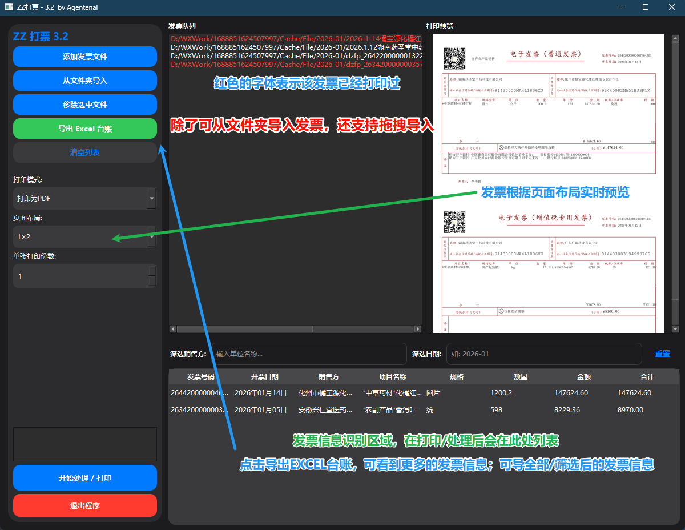

# ZZ 打票 (ZZ-Printer) v3.2 🚀

**ZZ 打票** 是一款集 **发票拼版打印** 与 **数字化台账管理** 于一体的高效工具。
它不仅能将多张电子发票（PDF/OFD）一键拼版打印，还能**自动提取发票关键信息**（如金额、税号、销售方等），并在打印的同时生成 Excel 报销台账，彻底解放财务人的双手。


---
## 界面预览

    界面预览


---

## ✨ 核心功能

### 1. 🖨️ 智能拼版打印
* **双格式兼容**：完美支持标准 PDF 电子发票及 OFD 国标版式文件。
* **灵活布局**：支持 `1×2` (双拼)、`2×2` (四拼) 等多种 A4 纸排版模式，节省纸张。
* **批量处理**：支持拖拽导入、文件夹批量导入。

### 2. 📊 自动化台账 (v3.0 新增)
* **深度解析**：引入 AI 级正则匹配引擎，精准提取发票号码、开票日期、**合计金额**、**购销双方名称/税号**及货物明细。
* **实时查重**：自动检测历史已打印发票，重复录入时**标红警示**，防止重复报销。
* **所见即所得导出**：
    * 支持按 **销售方名称** 或 **开票日期** 实时筛选台账。
    * 支持一键导出符合财务规范的 Excel 报表（包含完整的 16 列发票要素）。

### 3. 🎨 极致体验
* **iOS 风格 UI**：简洁现代的界面设计，自适应 Windows 深色/浅色模式。
* **配置记忆**：自动保存上次使用的布局、打印份数和导出路径。

---

## 🛠️ 部署与运行

### 1. 环境准备
确保已安装 Python 3.8 或更高版本。

### 2. 安装依赖
```bash
pip install -r requirements.txt

```

### 3. 启动软件

```bash
python zzprint.py

```

---

## 📦 打包指南 (生成 .exe)

为了确保信息提取引擎正常工作，打包时需包含隐藏的数据处理库。请直接运行项目根目录下的 `build.bat`，或手动执行：

```bash
pyinstaller --noconsole --onedir --name "ZZ打票" --clean ^
            --hidden-import pdfplumber ^
            --hidden-import pandas ^
            --hidden-import openpyxl ^
            --exclude-module PyQt5 ^
            zzprint.py

```

> **注意**：打包完成后，请分发 `dist/ZZ打票` 整个文件夹，不要单独发送 exe 文件。

---

## ⚠️ 常见问题

1. **为什么识别出的金额是 0.00？**
* 这是因为部分发票使用了非标准的全角/半角括号。v3.2 版本已修复此问题，支持识别 `(小写)` 和 `（小写）` 格式。


2. **可以直接连接打印机打印吗？**
* 目前推荐使用“打印为 PDF”模式，生成合并好的 PDF 后，再使用系统阅读器进行物理打印，以获得最佳清晰度。


3. **杀毒软件误报？**
* 由于软件未购买数字签名，从 Excel 导出文件时可能会被安全软件拦截，请选择“允许程序运行”即可。


---

## 📜 开源协议

本项目采用 [MIT License](https://www.google.com/search?q=LICENSE) 许可。