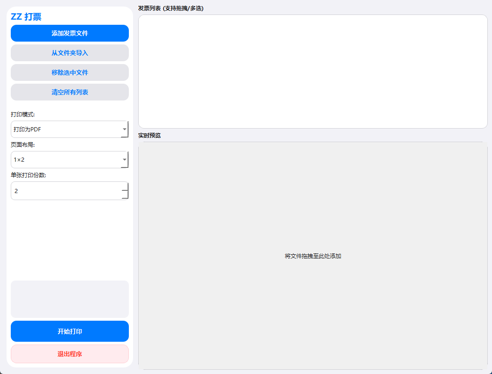

# ZZ 打票 (ZZ-Printer) 🚀

**ZZ 打票** 是一款基于 Python 和 PyQt6 开发的高效电子发票拼版工具。它专为财务报销和个人票据管理设计，能够将多张 PDF 或 OFD 格式的发票智能排列在 A4 纸上，从而节省纸张并提高打印效率。

项目地址: [https://github.com/agentenal/zzprint](https://github.com/agentenal/zzprint)

---
## 工具界面
img\PixPin_2026-01-14_09-17-54.png
## ✨ 功能亮点

- **双格式兼容**：全面支持传统 PDF 发票及最新的国标 OFD 发票格式。
- **智能拼版布局**：
    - 提供 `1×1`, `1×2`, `1×3` 纵向单列布局。
    - 提供 `2×2`, `2×3`, `2×4` 纵向双列布局（注：`2×3` 为纵向 2 列 3 行）。
- **iOS 风格 UI**：简洁灵动的界面，支持随系统自动切换的 **深色/浅色模式**。
- **高效交互**：
    - **拖拽支持**：支持直接从资源管理器将发票文件拖入列表。
    - **路径记忆**：自动记录上次打开文件和保存 PDF 的路径。
    - **批量管理**：支持多选移除选中文件、一键清空列表。

---

## ⚠️ 现有问题与限制

- **直接打印功能暂不可用**：
    - 目前程序核心逻辑侧重于 PDF 渲染与拼版，物理打印机的 GDI 接口对接尚在完善中。
    - **临时方案**：请在程序中选择“打印为 PDF”模式，生成合并后的文件后，使用系统自带的 PDF 查看器进行物理打印。

---

## 🛠️ 部署与安装

### 1. 环境要求
- **Python 3.8+**
- **操作系统**：Windows 10/11 (推荐，以获得最佳深色模式适配)

### 2. 克隆项目
```bash
git clone [https://github.com/agentenal/zzprint.git](https://github.com/agentenal/zzprint.git)
cd zzprint

```

### 3. 创建与激活虚拟环境

建议使用虚拟环境以保持依赖纯净：

```powershell
# 创建虚拟环境
python -m venv venv_printer

# 激活环境
.\venv_printer\Scripts\activate

```

### 4. 安装依赖

```powershell
pip install PyQt6 PyMuPDF

```

---

## 🚀 使用方法

1. **导入文件**：点击“添加发票文件”或直接将 PDF/OFD 文件拖拽进程序列表。
2. **配置布局**：
* 选择所需的页面布局（如 `1×2` 或 `2×3`）。
* 设置单张发票需要重复打印的份数（1-4份）。


3. **设置打印模式**：
* 确保下拉框选择为 **“打印为 PDF”**。


4. **生成拼版**：
* 点击“开始打印”，在弹出的对话框中选择保存位置。
* 生成后，程序会自动打开生成的 PDF 文件供查看和打印。


---

## 📦 打包步骤 (生成可执行文件)

为了获得最佳的运行速度（避免 `--onefile` 模式的解压延迟），建议使用 `onedir` 文件夹模式打包：

1. **安装打包工具**：
```powershell
pip install pyinstaller

```


2. **运行打包脚本**：
双击运行项目根目录下的 `build.bat`。该脚本会自动执行以下优化命令：
```powershell
pyinstaller --noconsole --onedir --name "ZZ打票" --clean --exclude-module PyQt5 zzprint.py

```


3. **获取成品**：
* 打包完成后，进入项目目录下的 `dist` 文件夹。
* 找到 `ZZ打票` 文件夹，主程序为 `ZZ打票.exe`。
* **分发建议**：请压缩整个 `ZZ打票` 文件夹分发给用户，不要只发送单个 `.exe` 文件。


---

## 📜 许可证

本项目采用 [MIT License](https://www.google.com/search?q=LICENSE) 许可协议。

