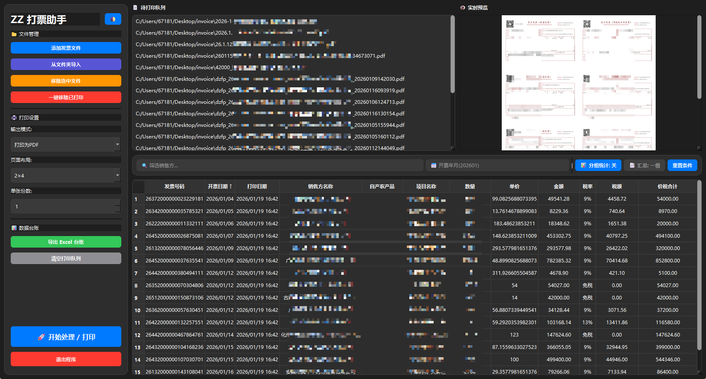
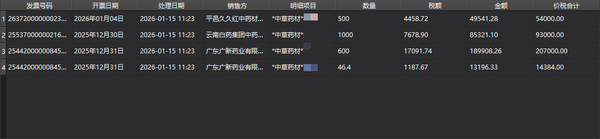
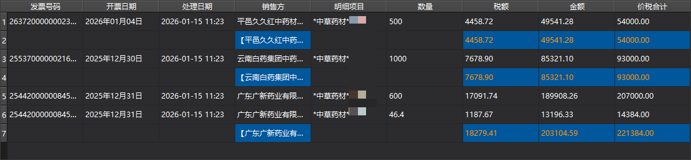
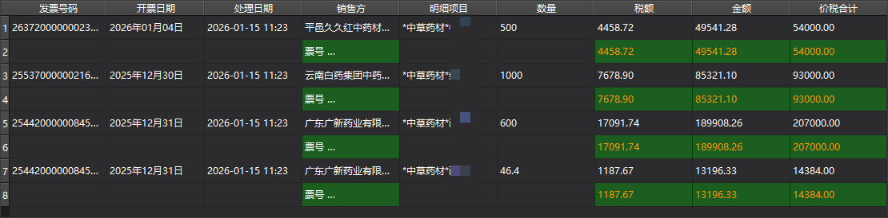
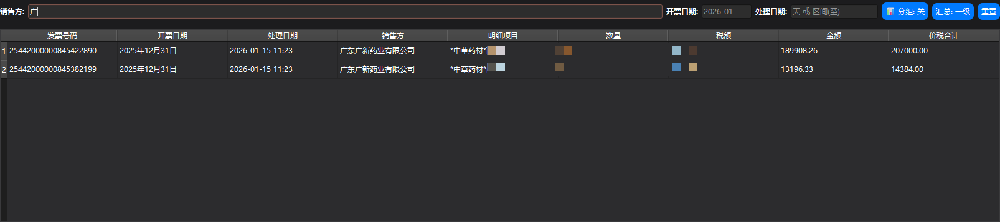

# 🧾 发票打印助手 (ZZPrinter) v3.6

**一款专为采购、财务、出纳及行政人员设计的发票批处理与自动化台账管理工具。**

本工具支持发票信息的自动提取、A4 纸拼版打印，并能自动生成包含详细明细的电子台账。v3.6 版本深度优化了汇总逻辑，引入了类似 Excel 透视表的分级汇总功能。

---

## ✨ 界面预览
*(请根据实际截图更新图片路径)*









## ✨ 核心特性

* **⚡ 智能识别**：自动解析 PDF/OFD 格式发票，提取发票号码、开票日期、销售方信息及**所有商品明细**。
* **🖨️ 省纸拼版**：提供 1×1 到 2×4 多种布局模式，一张 A4 纸最高可打印 8 张发票。
* **📊 深度台账与分级汇总**：
    * **处理日期追踪**：自动记录发票的打印处理时间。
    * **一级汇总**：按“销售方”进行归集，显示该供应商的金额、税额、价税合计总计。
    * **二级汇总（新）**：在销售方的基础上，增加**按打印日期（天）**的次级汇总。实现同一天、同一供应商的业务自动小计，效果等同于 Excel 数据透视表。
* **📥 展平式导出**：一键导出 Excel 台账，所有明细字段独立成列，方便直接用于财务报表或税务勾选。
* **🌓 双色主题**：内置深色（Dark）与浅色（Light）模式，保护视力。

---

## 🚀 快速开始

### 1. 环境依赖
确保您的电脑已安装 Python 3.8+，并安装以下库：
```bash
pip install PyQt6 PyMuPDF pdfplumber pandas openpyxl

```

### 2. 运行程序

```bash
python zzprint.py

```

---

## 🛠️ 功能操作指南

### **台账筛选与汇总**

* **关键词筛选**：在顶部搜索框输入销售方名称或开票年月，表格会实时更新。
* **开启分组模式**：点击“📊 分组统计”按钮。
* **一级汇总**：查看每个供应商的累计金额。
* **二级汇总**：系统会先按“销售方”分类，再在内部按“打印日期”进行二次小计。适合查看“某供应商在某一天一共打印了多少钱的发票”。


* **手动排序**：在非分组模式下，点击表头（如“打印日期”）可进行升序/降序排列。

### **导出 Excel**

* 点击“导出 Excel 台账”，程序会将当前**筛选后**的结果导出。
* 导出的表格已将发票明细“展平”：即如果一张发票有 3 行商品明细，Excel 中将对应 3 行记录，每行包含完整的发票头信息。

---

## 📅 版本更新记录

### v3.6 (最新版)

* **【重大更新】** 优化二级汇总逻辑：由原先的“按发票号汇总”改为**“按打印日期汇总”**。
* **【优化】** 增强了日期识别的鲁棒性，支持多种日期格式自动归一化为 `yyyy/mm/dd`。
* **【优化】** 默认排序调整：在汇总模式下，同一销售方的记录按打印日期**倒序**排列（最近打印的显示在最上方）。

### v3.5

* **【优化】** 彻底重构 Excel 导出逻辑，实现明细数据全字段独立列展示。
* **【修复】** 优化了旧版本 `invoice_ledger.json` 数据的向下兼容性。

### v3.4

* **【新增】** 处理日期追踪功能，记录发票打印处理的具体时间。
* **【新增】** 支持处理日期区间筛选。

---

## 📝 注意事项

* **数据安全**：所有发票台账数据均保存在本地 `invoice_ledger.json` 中，建议定期备份。
* **文件支持**：支持标准电子发票（PDF/OFD）。
* **排序说明**：在开启“分组统计”时，为了保证汇总计算准确，系统会采用固定的“销售方+日期”排序规则，此时表头点击排序功能将暂时禁用。

